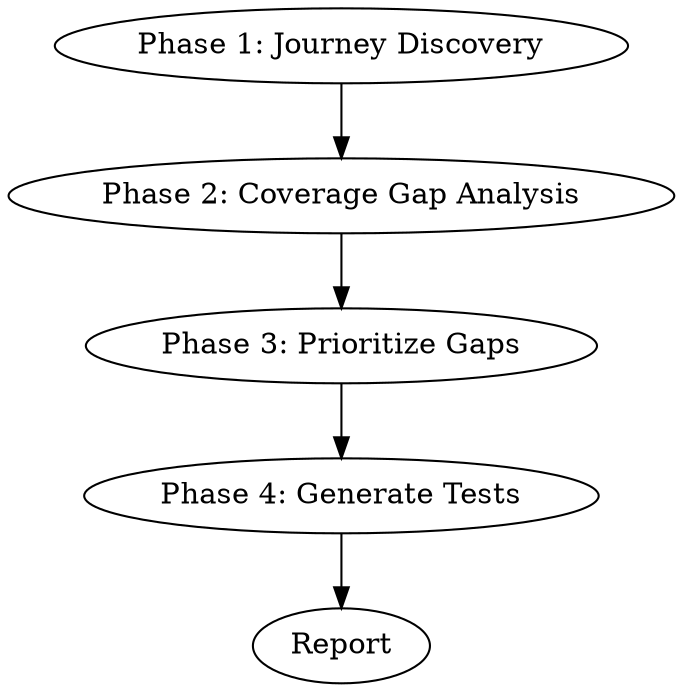

# Tauri Test Generator

> **Platform note:** L3 tests are cross-platform, but L4 patterns (CDP, pywinauto, UIA)
> have only been tested on Windows. macOS/Linux equivalents are unverified.

Generate the right tests at the right layer by first understanding user journeys.
Write tests for **user outcomes**, not code coverage — then map each journey step
to the cheapest test layer that verifies it.

**REQUIRED BACKGROUND:** `tauri-test-setup` defines the L1-L4 layer model and
mock recipes. This skill builds on that foundation.

## When to Use

- Adding tests to a Tauri app (new or existing)
- After implementing a feature, need tests
- Running a test coverage audit
- NOT for: setting up test infrastructure from scratch (use `tauri-test-setup`)

## Workflow



### Phase 1: Journey Discovery

Discover user journeys by scanning **four sources** in the codebase:

| Source | How to find | What it reveals |
|--------|-------------|-----------------|
| Tauri commands | `grep '#\[tauri::command\]'` in `src-tauri/src/` | Backend capabilities — group related commands into journeys |
| Store actions | Read Zustand store — find methods calling `invoke()` or `emit()` | Frontend-initiated journey steps |
| Entry points | List all HTML files (`index.html`, `pages/*.html`) | Each window = separate test surface |
| Event listeners | `grep 'listen('` in frontend | Backend-to-frontend events = reactive journey steps |

**Grouping commands into journeys:** Commands that share state or that the user
triggers in sequence belong to the same journey. Also look for:
- **Startup journeys** — commands called during app init (load state, restore settings)
- **Error/fallback paths** — what happens when a command fails or a resource is missing
- **Unused commands** — commands with no frontend caller (flag these as findings)

**Output a journey table:**

```markdown
| ID | Journey | Steps (action → IPC → effect) | Entry Point |
|----|---------|-------------------------------|-------------|
| J-01 | Soundpack switch | See list → select → invoke switch_soundpack → persist → play new | main |
| J-02 | Volume control | Drag slider → throttled invoke set_volume → audio engine update | main |
```

Each step must note: (1) the frontend action, (2) the IPC call if any, (3) the backend effect.

**Identifying L3+L4 hybrid journeys:** Some journeys cross the OS/WebView boundary
within a single flow. Mark these as `L3+L4` in the Layer column:

| Signal | Example |
|--------|---------|
| OS trigger → WebView UI manipulation | Tray menu → settings toggle |
| WebView UI → OS side-effect verification | Switch click → registry change |
| WebView element not in UIA tree | Radix Switch, Shadow DOM, Canvas controls |

```markdown
| ID | Journey | Steps | Layer |
|----|---------|-------|-------|
| J-05 | Autostart toggle | Tray "Preferences"(L4) → click switch(L3/CDP) → registry verify(L4) | L3+L4 |
```

See `tauri-test-setup` Step 4a for the hybrid infrastructure pattern.

### Phase 2: Coverage Gap Analysis

For each journey step, check if an **existing test** already covers it.

1. Read ALL test files: `*.test.ts(x)`, `*.spec.ts`, Rust `#[cfg(test)]` modules
2. Map each existing test → the journey step it verifies
3. Mark uncovered steps as gaps

**Output a coverage matrix:**

```markdown
| Journey | Step | Existing Test | Layer | Status |
|---------|------|---------------|-------|--------|
| J-01 | UI renders 3 cards | qa-phase1beta.test.tsx QA#5 | L2 | Covered |
| J-01 | Select triggers invoke | app-store.test.ts selectSound | L2 | Covered |
| J-01 | Persist to settings.json | (none) | L1 | Gap |
| J-01 | New sound plays on keypress | (cannot automate) | L4 | Manual |
```

### Phase 3: Prioritize Gaps

Score each gap to decide what to write first:

| Factor | High | Low |
|--------|------|-----|
| **User impact** | Core journey (daily use) | Edge case (rare trigger) |
| **Failure cost** | Data loss, crash, silent corruption | Cosmetic, recoverable |
| **Ease of test** | Mock infra exists, pattern available | Needs new infra or OS setup |

**Rule:** High impact + easy → write now. High impact + hard → document as manual QA.
Low impact → skip unless specifically requested.

### Phase 4: Generate Tests

For each prioritized gap:

1. **Assign the layer** using `tauri-test-setup` Step 1 Classification Criteria
2. **Find existing patterns** in the project before writing code:

1. Find a test file at the **same layer** that tests a **similar feature**
2. Copy its structure: imports, mock setup, beforeEach, assertion style, naming convention
3. Adapt for the new journey step

This is not optional — inconsistent test patterns make maintenance harder than missing tests.

**L3+L4 hybrid test generation:** When a gap is classified as `L3+L4`:

1. Use `helpers/cdp.py` `connect_cdp()` context manager — NOT a pytest fixture
2. Open the target window (via pywinauto or other OS-level action) **before** `connect_cdp()`
3. Use text-based locators (`div:has-text("label") [role="switch"]`) as primary,
   `data-testid` as enhancement — `data-testid` requires a frontend rebuild
4. Check `data-state` attribute for Radix component state (e.g., `data-state="checked"`)
5. Keep OS-level assertions (registry, filesystem) **outside** the `with connect_cdp()` block

See `tauri-test-setup` Step 4a for the full hybrid infrastructure reference.

**Test naming convention:** Match the project. If existing tests use Korean behavior
descriptions (e.g., `"re-selecting same soundpack should not invoke"`), follow that.
If existing tests use English, follow that.

## Output

The skill produces two things:

1. **Journey Coverage Report** (conversation) — summary of all journeys, steps, gaps, and priorities
2. **Test code** (files) — actual tests for prioritized gaps, following project conventions

## Surprising Findings

During analysis, flag anything unexpected. These are often more valuable than
the tests themselves:

- **Unused commands** — Tauri commands with no frontend caller (dead code or future API)
- **Missing test infrastructure** — e.g., no pattern for mocking `AppHandle` in Rust tests
- **Hardcoded data that should be dynamic** — e.g., preset lists duplicated between frontend constants and backend resources
- **Structural gaps** — features where an entire test layer is impossible due to missing infra

Report findings at the end of the coverage report, with actionable recommendations.

## Common Mistakes

| Mistake | Why it fails | Fix |
|---------|-------------|-----|
| Jump to writing tests without journey discovery | Tests cover implementation, miss user outcomes | Always run Phase 1 first |
| Write E2E for something testable at L2 | Slow, flaky, hard to maintain | Pick the **cheapest** layer |
| Generate tests that duplicate existing ones | Wasted effort, maintenance burden | Phase 2 gap analysis catches this |
| Hardcode expected values in E2E | Tauri persists state — stale values break tests | Use relative assertions (before → change → verify delta) |
| Test OS features via CDP | CDP `press_key` only fires WebView events, not global hooks | Use Python native tests (pywinauto) for tray/registry, mark audio/key hooks as manual |
| Invent new mock patterns | Inconsistent tests are worse than no tests | Reuse existing patterns from the project |
| Search tray icon by app name in `Shell_TrayWnd` | Matches taskbar app button, not the tray notification icon | Filter by `SystemTray.NormalButton` class in overflow area only |
| Right-click tray icon found in Windows 11 overflow via name match | OS shows Jump List instead of app context menu | The app button and tray icon are separate UIA elements — see `tauri-test-setup` L4 section |
| Omit `.tooltip()` on `TrayIconBuilder` | Tray icon has empty UIA name — automation tools can't find it | Always set `.tooltip()` for testability and accessibility |
| Use `Desktop().windows()` in polling loops | UIA COM crash `0x80040155` on repeated calls (Python 3.14 + pywinauto) | Use `FindWindowW` via ctypes for window-existence polling |
| Assume `SendInput`/pynput triggers global key hooks | OS sets `LLKHF_INJECTED` flag; hooks filtering injected events (rdev, WH_KEYBOARD_LL with INJECTED check) won't respond | Document as untestable via SendInput — requires code-level bypass or hardware emulation |
| Connect CDP before target window opens | WebView2 CDP only sees windows at connection time — new windows are NOT auto-detected on existing connections | Open the window first (pywinauto), then `connect_cdp()`. Use context manager, not fixture |
| Use `data-testid` locator without rebuilding | `data-testid` is a frontend source change — the running binary has the old DOM | Use text+role locator (`div:has-text("label") [role="switch"]`) as primary; `data-testid` as enhancement after rebuild |
| Put pywinauto and CDP in the same L4 test without hybrid infrastructure | CDP fixture connects too early, can't find dynamically created windows | Use `helpers/cdp.py` context manager + L3+L4 hybrid pattern from `tauri-test-setup` Step 4a |
